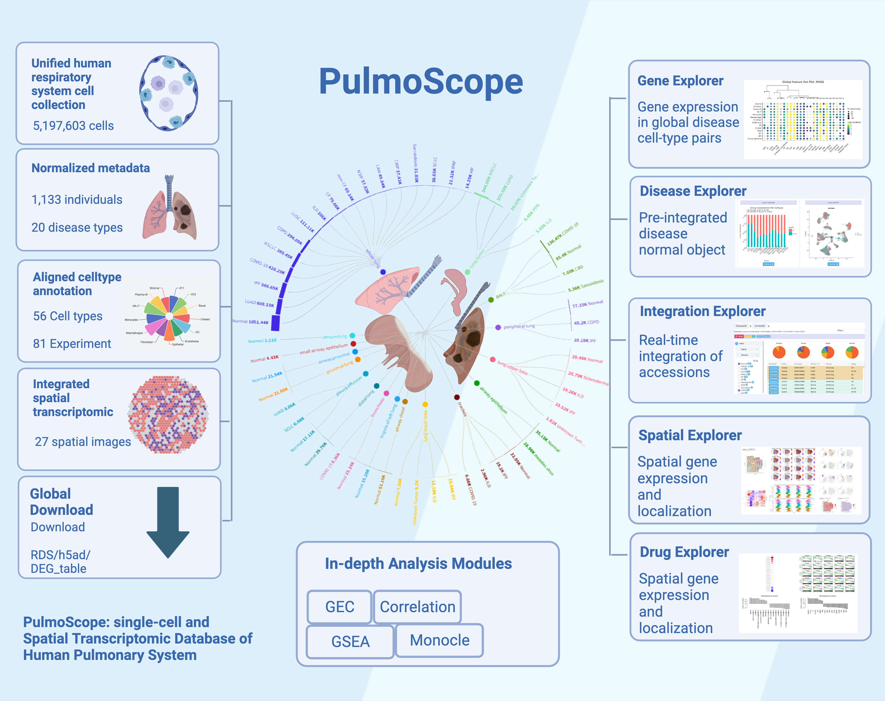

# PulmoScope: A Comprehensive Platform for Custom Integration, Analysis and Visualization of  Single-cell and Spatial Transcriptomic Data of Human Pulmonary System

<p align="center">
  
</p>

## PulmoScope analysis scripts

This project covers all analysis scripts for all five explorers and the corresponding modules: Gene Explorer, Disease Explorer, Integration Explorer, Spatial Explorer, and Drug Explorer
Besides, you can find the supplemental `BP_Merge_Script` and `rds2h5ad` for large-scale scRNA-seq integration. The implementation details of data storage and large-scale analysis acceleration can be further learned here: https://github.com/bnprks/BPCells.

## [Learn more at our web server](http://www.gzlb.miracle.ac.cn:9800/PulmoScope/home)

## Basic Usage

Template script:

```Bash
bash Explorer_Runner.sh Enrichment_Analysis.R KEGG front_end_parameters user_id 
```

1. `Gene Explorer`:
   - `global_feature.R` compares cross-disease gene expression for every cell type and visualize in dotplot.
   - `DEG_Display.R` compares every precalculated GroupDEG of every disease in FeaturePlot, ViolinPlot, and FractionPlot.
2. `Disease Explorer`:
   - `Plot_TopMarkers.R` allows you to check cell distribution and composition of every disease-normal pair and calculate cell type markers for every cell type.
   - `GroupDEG` allows you to zoom into every cell type of disease-normal pair and get a more concentrated GroupDEG.
3. `Integration Explorer`:
   - `Step1_Preparation.R` provides flexible integration across any scRNA-seq accessions.
4. `Spatial Explorer`:
   - `stFeature.R` displays every spatial image with calculated spatial cell type distribution and allows users to explore spatial gene expression.
5. `Drug Explorer` extends disease GroupDEG to calculate the inverse effects and enriched pathways most related on LINCS1000 dataset.

```Bash
bash Explorer_Runner.sh global_Feature.R global_feature goi.txt /path/to/dir
```

```Bash
bash Explorer_Runner.sh /path/to/dir DEG_Display.R diseaseName gene_info.csv
```

```Bash
bash Explorer_Runner.sh /path/to/dir Plot_TopMarkers.R logFC pvalue topNum 
```

```Bash
bash Explorer_Runner.sh /path/to/dir Groupwise_DEG.R logFC pvalue topNum celltype
```

```Bash
bash Explorer_Runner.sh /path/to/dir Step1_Preparation.R  sample_info.txt
```

```Bash
bash Explorer_Runner.sh stFeature.R  image_ID goi.txt /path/to/dir
```

## conda environment Setup and Installation

Three main conda environments are required:

- BPCells:
    1. conda install: prepare `BPCells` environment via `BPCell_ENV.yaml`
    2. extra pip install: `BPCells_requirements.txt`
    3. install `BPCells`

```R
remotes::install_github("bnprks/BPCells")
```

- Monocle2:
    1. conda install: prepare `Monocle2` environment via `Monocle2_ENV.yaml`
    2. install `Monocle2`

```bash
conda install -c bioconda bioconductor-monocle
```

- Giotto:
    1. conda install: prepare `Giotto` environment via `giotto_ENV.yaml`
    2. extra pip install: `Giotto_requirement.txt`
    3. install `Giotto`

```R
library(devtools) # If not installed: install.packages('devtools')
library(remotes)  #If not installed: install.packages('remotes')
remotes::install_github("drieslab/Giotto@master")
```

## Large-scale Data Storage and Performance Efficiency

PulmoScope hosts over 5 million metadata harmonized scRNA-seq data from over 1,100 human samples across 20 disease conditions. Implemented with BPCells integration and Bit-packing compression techniques, the overall 5 million scRNA-seq data requires less than 50GB storage space with an average open time of 0.344 seconds for every 1,000,000 cells data object.
